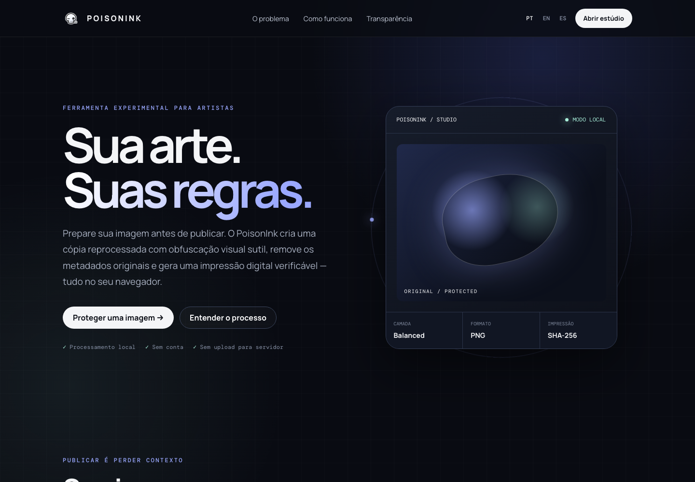

<div align="center">

# ☠️ PoisonInk

**Your art. Your rules.**

<p>
  
  
  
  
  
</p>

A local-first image preparation studio that helps artists export a modified copy and a verifiable fingerprint before publishing their work.

[Open the website](https://landing-page-poison-ink.vercel.app/) · [Launch the studio](https://landing-page-poison-ink.vercel.app/studio/)

</div>

---

## Preview



---

## About the project

PoisonInk is an independent portfolio prototype focused on transparent, browser-only image preparation. The studio applies a configurable visual perturbation layer, re-encodes the result without the original metadata, and generates a SHA-256 fingerprint for the exported file.

The artwork remains on the user's device throughout the process. The interface explains each step instead of promising universal protection against scraping, copying, or model training.

## Features

- Drag-and-drop image selection
- Adjustable visual perturbation strength
- Side-by-side original and processed previews
- Metadata removal through canvas re-encoding
- SHA-256 fingerprint generation
- PNG export with a clear processing summary
- Local browser history for recent exports
- Portuguese, English, and Spanish interfaces
- Responsive landing page and studio workspace

## How it works

```text
Selected image
      ↓
Browser canvas processing
      ↓
Visual perturbation + clean re-encoding
      ↓
PNG export + SHA-256 fingerprint
```

No image is uploaded to a PoisonInk server. Recent activity is stored only in the current browser.

## Technology

| Area | Technology |
| --- | --- |
| Structure | Semantic HTML5 |
| Styling | Responsive CSS |
| Image processing | Canvas API |
| Fingerprint | Web Crypto API |
| Local history | `localStorage` |
| Deployment | Vercel |

## Run locally

No build step or dependency installation is required.

```bash
git clone https://github.com/Lime4idan/Landing-Page-PoisonInk.git
cd Landing-Page-PoisonInk
python3 -m http.server 4173
```

Open `http://localhost:4173` for the landing page or `http://localhost:4173/studio/` for the working studio.

## Project structure

```text
Landing-Page-PoisonInk/
├── index.html          # product landing page
├── studio/
│   └── index.html      # working local-first studio
├── assets/
│   ├── styles.css      # shared visual system
│   ├── site.js         # landing-page interactions
│   ├── studio.js       # image-processing workflow
│   └── logo.png
└── vercel.json
```

## Important limitation

PoisonInk is an experimental portfolio project. Visual perturbation and file fingerprints can support an artist's publishing workflow, but they cannot guarantee that an image will never be copied, scraped, altered, or used by an external system.

## Project status

**Status:** Live and functional prototype  
**Focus:** Browser image processing, privacy, transparent communication, and visual identity

---

<div align="center">

### ☠️ Protection should be understandable before it is trusted.

</div>
